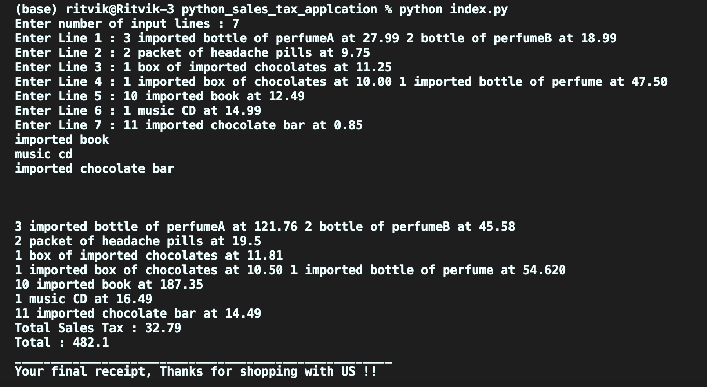

# Problem Statement

> When I purchase items I receive a receipt which lists the name of all the items and their price (including tax), finishing with the total cost of the items, and the total amounts of sales taxes paid. The rounding rules for sales tax are that for a tax rate of n%, a shelf price of p contains (np/100 rounded up to the nearest 0.05) amount of sales tax.

## Problem Solving Approach

**While solving the problem Regular Expressions and string formatting algorithms have been used along with string pattern matching algorithms.**

## How to Run the application

Based on the OS you have,
`python index.py` should work.

## Sample Input

3 imported bottle of perfumeA at 27.99 2 bottle of perfumeB at 18.99\
 2 packet of headache pills at 9.75\
 1 box of imported chocolates at 11.25\
 1 imported box of chocolates at 10.00 1 imported bottle of perfume at 47.50\
10 imported book at 12.49\
 1 music CD at 14.99\
 11 imported chocolate bar at 0.85\

## Output Screenshot

